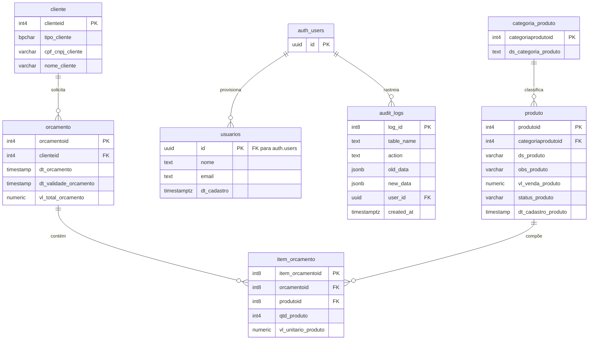

# Orc Studio — Sistema de Gestão e Orçamentos

> Aplicação Web do tipo Single Page Application (SPA), client-side, para gestão de clientes, produtos, orçamentos e métricas de negócio — com backend Supabase (PostgreSQL + Auth), segurança por Row Level Security e rastreabilidade completa via Audit Logs.

---

## Sumário

- [Visão Geral](#visão-geral)
- [Stack Tecnológica](#stack-tecnológica)
- [Estrutura do Projeto](#estrutura-do-projeto)
- [Funcionalidades](#funcionalidades)
- [Schema do Banco de Dados](#schema-do-banco-de-dados)
- [Diagrama do Banco de Dados](#diagrama-do-banco-de-dados)
- [Segurança e Auditoria](#segurança-e-auditoria)
- [Como Executar](#como-executar)
- [Configuração](#configuração)
- [Roadmap](#roadmap)

---

## Visão Geral

**Orc Studio** é um sistema de gestão comercial desenvolvido como projeto de portfólio. Permite que pequenas empresas gerenciem sua base de clientes, catálogo de produtos e o ciclo completo de propostas comerciais — desde a criação e edição até a geração de PDF e exportação para Excel.

A aplicação é estruturada como uma SPA puramente frontend, sem servidor dedicado. Toda a persistência de dados, autenticação, controle de acesso e rastreabilidade de alterações são gerenciados pelo [Supabase](https://supabase.com), tornando a arquitetura leve e facilmente implantável em qualquer provedor de hospedagem estática.

---

## Stack Tecnológica

| Camada | Tecnologia |
|---|---|
| Frontend | HTML5 puro, CSS3 (CSS Variables), JavaScript ES Modules |
| Backend / Banco de Dados | [Supabase](https://supabase.com) (PostgreSQL + Auth + RLS + Triggers) |
| Roteamento | SPA router customizado (`router.js`) |
| Gráficos | [Chart.js](https://www.chartjs.org/) |
| Alertas e Modais | [SweetAlert2](https://sweetalert2.github.io/) |
| Ícones | [Lucide](https://lucide.dev/) |
| Exportação Excel | [SheetJS (xlsx)](https://sheetjs.com/) |
| Geração de PDF | `window.print()` nativo com template HTML personalizado |
| Animações | [particles.js](https://vincentgarreau.com/particles.js/) (tela de login) |
| Hospedagem | Qualquer servidor de arquivos estáticos (Nginx, Vercel, GitHub Pages, etc.) |

---

## Estrutura do Projeto

```
orc-studio/
├── index.html                   # Shell principal da SPA (sidebar + topbar + ponto de montagem)
├── login.html                   # Tela de login com animação de partículas
│
├── css/
│   ├── style.css                # Estilos globais (variáveis, layout, responsividade)
│   └── login_style.css          # Estilos exclusivos da tela de login (tema dark futurístico)
│
├── js/
│   ├── config.js                # Inicialização do cliente Supabase
│   ├── router.js                # Roteamento SPA + guarda de autenticação + topbar
│   ├── login.js                 # Auth: sign-in, recuperação de senha
│   ├── clientes.js              # CRUD de clientes + validação de CPF/CNPJ
│   ├── produtos.js              # CRUD de produtos + dropdown de categorias
│   ├── categorias_produtos.js   # CRUD de categorias de produtos
│   ├── orcamentos.js            # Orçamentos: criação, edição, PDF, exportação Excel
│   ├── metricas.js              # Dashboard: cards KPI + 4 gráficos Chart.js
│   ├── usuarios.js              # Gestão de usuários via Supabase Auth
│   └── perfil_usuario.js        # Perfil do usuário autenticado (dados do JWT)
│
└── views/
    ├── clientes.html
    ├── produtos.html
    ├── categorias_produtos.html
    ├── orcamentos.html
    ├── metricas.html
    ├── usuarios.html
    └── perfil_usuario.html
```

---

## Funcionalidades

### Clientes (`clientes.js`)
- Cadastro e atualização de clientes (Pessoa Física ou Jurídica)
- Validação de **CPF** e **CNPJ** por cálculo de dígitos verificadores antes do envio
- Busca em tempo real por ID ou número de documento, contra cache local em memória para evitar chamadas redundantes ao banco

### Categorias de Produtos (`categorias_produtos.js`)
- Criação e edição de categorias de produtos
- Modo de edição inline com botão de cancelar
- Busca local em tempo real por ID ou descrição

### Produtos (`produtos.js`)
- Catálogo completo de produtos com associação a categoria (dropdown via chave estrangeira)
- Status Ativo / Inativo com badges visuais diferenciados
- Exclusão segura: apenas produtos **INATIVOS** e sem vínculos em orçamentos podem ser deletados, com confirmação via modal SweetAlert2
- Busca local em tempo real por ID, descrição ou nome de categoria

### Orçamentos (`orcamentos.js`)
- Criação de novos orçamentos com seleção de cliente, data de validade e itens dinâmicos
- Validação: pelo menos um item obrigatório; data de validade deve ser futura
- Edição de orçamentos existentes: itens substituídos atomicamente via chamada RPC no Supabase (`update_orcamento_items`)
- Indicador de status: 🟢 válido / 🚩 expirado, calculado no cliente com base na data de validade
- **Exportação PDF**: gera documento pronto para impressão em nova aba, usando template HTML personalizado e `window.print()`
- **Exportação Excel individual**: exporta os itens de um único orçamento como arquivo `.xlsx` via SheetJS
- **Exportação Excel por período**: consulta orçamentos por intervalo de datas e exporta relatório com coluna de status calculado
- Barra de busca avançada com filtro de período e modos de pesquisa alternáveis por ID ou Nome do cliente

### Dashboard de Métricas (`metricas.js`)
- Busca paralela em quatro tabelas do Supabase para maximizar desempenho
- Filtro de datas inteligente com detecção automática do registro mais antigo no banco
- Dois cards KPI: **Orçamentos Válidos** e **Orçamentos Expirados**, cada um com quantidade, média, mínimo e máximo em R$
- Quatro visualizações Chart.js:
  - **Evolução temporal** — gráfico de linhas (válidos vs. expirados por dia)
  - **Top 3 produtos recorrentes** — gráfico de barras por total de unidades solicitadas
  - **Top 3 clientes por volume** — gráfico de barras por quantidade de orçamentos
  - **Top 3 clientes por ticket médio** — gráfico de barras com formatação em BRL no eixo Y

### Gestão de Usuários (`usuarios.js`)
- Provisionamento de novos usuários via Supabase Auth (`signUp`)
- Nome completo armazenado em `user_metadata` para saudações personalizadas
- Busca de usuários ativos por ID, nome ou e-mail

### Autenticação (`login.js`)
- Autenticação nativa Supabase por e-mail e senha (`signInWithPassword`)
- Token de sessão gerenciado automaticamente pelo cliente Supabase (armazenado no `localStorage`)
- Fluxo de "Esqueci minha senha" via `resetPasswordForEmail`
- Tela de login com background animado pelo `particles.js`

### Topbar e Perfil do Usuário (`router.js` + `perfil_usuario.js`)
- **Guarda de rota**: ao inicializar, o `router.js` verifica a sessão ativa via `supabase.auth.getSession()`; usuários não autenticados são redirecionados imediatamente para `login.html`
- **Topbar fixa**: exibe avatar com inicial do nome, nome do usuário logado e menu dropdown com opções "Meu Perfil" e "Sair"
- **Logout nativo**: encerra a sessão via `supabase.auth.signOut()` e redireciona para o login
- **Página de perfil** (`perfil_usuario.html`): exibe nome identificado, e-mail de acesso e UUID único da instância — dados recuperados diretamente do token JWT sem chamada adicional ao banco

### Roteamento (`router.js`)
- SPA router leve: carrega fragmentos HTML das views sob demanda via `fetch()` e aciona a função `init*` correspondente
- Sidebar responsiva com hambúrguer e overlay para telas móveis (breakpoint ≤ 768px)

---

## Schema do Banco de Dados

A aplicação depende das seguintes tabelas no Supabase (PostgreSQL):

| Tabela | Colunas Principais |
|---|---|
| `cliente` | `clienteid`, `tipo_cliente` (F/J), `cpf_cnpj_cliente`, `nome_cliente` |
| `categoria_produto` | `categoriaprodutoid`, `ds_categoria_produto` |
| `produto` | `produtoid`, `categoriaprodutoid` (FK), `ds_produto`, `obs_produto`, `vl_venda_produto`, `status_produto`, `dt_cadastro_produto` |
| `orcamento` | `orcamentoid`, `clienteid` (FK), `dt_orcamento`, `dt_validade_orcamento`, `vl_total_orcamento` |
| `item_orcamento` | `orcamentoid` (FK), `produtoid` (FK), `qtd_produto`, `vl_unitario_produto` |
| `usuarios` | `id`, `nome`, `email`, `dt_cadastro` |
| `audit_logs` | `log_id`, `table_name`, `action`, `old_data`, `new_data`, `user_id`, `created_at` |

A função RPC `update_orcamento_items(p_orcamentoid, p_items)` garante a substituição atômica dos itens de um orçamento durante edições.

---

## Segurança e Auditoria

### Princípios Gerais de Segurança

- **Nenhuma `service_role` key exposta no cliente**: todas as requisições do navegador utilizam exclusivamente a `SUPABASE_ANON_KEY` (chave publicável).
- **Row Level Security (RLS)** habilitado em todas as tabelas de negócio, restringindo o acesso a sessões autenticadas.
- Operações administrativas que exigem permissões elevadas (ex.: listagem de usuários do Auth) são tratadas exclusivamente via **Supabase Edge Functions**, mantendo chaves privilegiadas fora do alcance do cliente.
- O `router.js` implementa um **guarda de rota na inicialização**: se não houver sessão ativa, o usuário é redirecionado para `login.html` antes de qualquer renderização.

### Auditoria de Alterações (Audit Logs)

Para garantir rastreabilidade completa das operações críticas, o banco de dados conta com uma tabela dedicada de logs de auditoria e triggers automatizados nas principais entidades do sistema.

#### Tabela `audit_logs`

Cada registro captura o estado completo da linha **antes e depois** da alteração, o tipo de operação e o UUID do usuário autenticado que executou a ação:

```sql
create table audit_logs (
    log_id     bigint primary key generated always as identity,
    table_name text not null,
    action     text not null,   -- 'INSERT', 'UPDATE' ou 'DELETE'
    old_data   jsonb,           -- Estado da linha ANTES da alteração
    new_data   jsonb,           -- Estado da linha APÓS a alteração
    user_id    uuid,            -- UUID do usuário autenticado (auth.uid())
    created_at timestamptz default now()
);

-- RLS: usuários autenticados podem ler os logs, mas ninguém pode apagá-los
alter table audit_logs enable row level security;
create policy "Leitura para usuários autenticados"
    on audit_logs for select
    using (auth.role() = 'authenticated');
```

#### Função de Trigger Reutilizável

Uma única função PostgreSQL (`log_audit_event`) é compartilhada por todos os triggers, eliminando duplicação de lógica:

```sql
create or replace function log_audit_event()
returns trigger as $$
begin
    insert into audit_logs (table_name, action, old_data, new_data, user_id)
    values (
        TG_TABLE_NAME::text,
        TG_OP,
        case when TG_OP = 'INSERT' then null else row_to_json(OLD)::jsonb end,
        case when TG_OP = 'DELETE' then null else row_to_json(NEW)::jsonb end,
        auth.uid()
    );

    if (TG_OP = 'DELETE') then
        return OLD;
    end if;
    return NEW;
end;
$$ language plpgsql security definer;
```

> O uso de `security definer` garante que a função execute com os privilégios do seu criador, não do usuário que disparou a operação — impedindo manipulação dos logs.

#### Triggers por Tabela

Os triggers são configurados para disparar **após** cada operação de INSERT, UPDATE ou DELETE nas tabelas críticas:

```sql
-- Tabela de Clientes
create trigger audit_cliente_changes
after insert or update or delete on cliente
for each row execute function log_audit_event();

-- Tabela de Produtos
create trigger audit_produto_changes
after insert or update or delete on produto
for each row execute function log_audit_event();

-- Tabela de Orçamentos
create trigger audit_orcamento_changes
after insert or update or delete on orcamento
for each row execute function log_audit_event();
```

#### Cobertura de Auditoria

| Tabela Monitorada | Operações Rastreadas |
|---|---|
| `cliente` | INSERT, UPDATE, DELETE |
| `produto` | INSERT, UPDATE, DELETE |
| `orcamento` | INSERT, UPDATE, DELETE |

> `item_orcamento` é gerenciada atomicamente via RPC (`update_orcamento_items`), de modo que as alterações nos itens ficam indiretamente rastreáveis pelo log do orçamento pai.

---

## Como Executar

### Pré-requisitos

- Um projeto [Supabase](https://supabase.com) com o schema descrito acima provisionado
- Qualquer servidor de arquivos estáticos (ex.: Live Server do VS Code, Nginx, ou hospedagem em nuvem como Vercel)

### Configuração

1. Clone ou baixe este repositório.

2. Abra `js/config.js` e substitua os valores de exemplo pelas credenciais do seu projeto:

```js
const SUPABASE_URL = "https://seu-projeto-id.supabase.co";
const SUPABASE_ANON_KEY = "sua-anon-key";
```

3. Sirva a raiz do projeto a partir de um servidor HTTP local ou remoto. Como o `router.js` utiliza `fetch()` para carregar os fragmentos de view, a aplicação **requer um servidor HTTP** — abrir o `index.html` diretamente como `file://` não funcionará.

4. Acesse `login.html` e autentique-se com uma conta de usuário Supabase Auth.

5. Para habilitar os Audit Logs, execute os scripts SQL da seção [Segurança e Auditoria](#segurança-e-auditoria) no SQL Editor do painel do Supabase, na ordem: criação da tabela → função de trigger → triggers por tabela.

---

## Configuração

| Arquivo | Finalidade |
|---|---|
| `js/config.js` | URL do projeto Supabase e anon key |
| `css/style.css` | Variáveis CSS globais (`--brand`, `--bg-main`, `--sidebar-width`, `--topbar-height`, etc.) |
| `index.html` | Imports de scripts via CDN (Supabase, Chart.js, SweetAlert2, Lucide, SheetJS) |

---

## Roadmap

As seguintes melhorias estão identificadas e planejadas para versões futuras:

- **Página de Controle de Estoque** — rastreamento de níveis de inventário por produto, histórico de movimentações de entrada e saída, e alertas de estoque mínimo
- **Busca aprimorada** — implementação de debounce nos campos de busca, destaque visual dos termos encontrados nos resultados e paginação server-side para grandes volumes de dados
- **Melhorias de UI/UX** — estados de carregamento com skeleton screens, substituição de todos os `alert()` nativos por notificações toast, refinamento da responsividade em dispositivos móveis e suporte a modo escuro na aplicação principal
- **Tela de redefinição de senha** — página dedicada para receber o redirect do fluxo `resetPasswordForEmail` do Supabase e permitir a definição de nova senha
- **Controle de acesso por papel (RBAC)** — restrição de acesso a módulos com base em perfis de usuário (ex.: `admin`, `operador`) armazenados em `user_metadata` ou em tabela dedicada no banco
- **Visualização dos Audit Logs na interface** — tela interna para que administradores consultem o histórico de alterações diretamente no sistema, com filtros por tabela, usuário e período
- **Expansão da cobertura de auditoria** — adicionar triggers para as tabelas `item_orcamento` e `categoria_produto`, garantindo rastreabilidade completa de todas as entidades de negócio

---

*Desenvolvido com Vanilla JS + Supabase — sem framework, sem dependências desnecessárias.*

---

## Diagrama do Banco de Dados



> **Notação de cardinalidade**: `||` = exatamente um · `o{` = zero ou muitos. As setas com pé-de-corvo indicam o lado "muitos" de cada relacionamento.